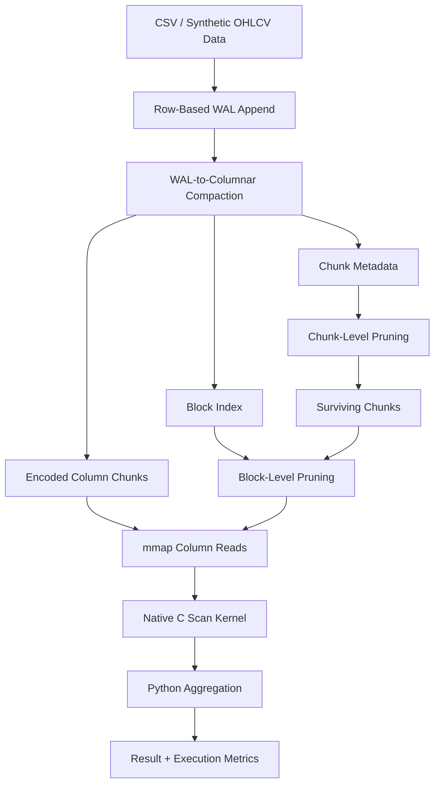

# TickDB

TickDB is a from-scratch analytical storage engine for OHLCV market data. It implements the core internals behind columnar databases used in market-data infrastructure: WAL ingestion, chunked columnar storage, two physical layouts, two-stage workload-aware pruning, encoding, mmap-based reads, and a native C scan kernel; in a system narrow enough to be fully understood and benchmarked end to end.

## Index

- [Why This Project](#why-this-project)
- [Appendix: Key Terms](#appendix-key-terms)
- [Architecture](#architecture)
- [Success Criteria](#success-criteria)
- [Non-Goals](#non-goals)
- [Benchmark Highlights](#benchmark-highlights)
- [Storage Layout](#storage-layout)
- [Design Decisions](#design-decisions)
- [Encoding Layer](#encoding-layer)
- [Two-Stage Pruning](#two-stage-pruning)
- [Native C Scan Kernel](#native-c-scan-kernel)
- [Benchmark Results](#benchmark-results)
- [Design Inspirations](#design-inspirations)
- [Use of AI](#use-of-ai)
- [Production Considerations](#production-considerations)
- [Quickstart](#quickstart)
- [Future Work](#future-work)

## Why This Project

Market-data analytics is not a generic workload. OHLCV queries are structurally different from OLTP queries: they are read-heavy, aggregation-heavy, and dominated by a small set of recurring shapes:

- symbol-bounded: filter to one or a few tickers
- time-bounded: range scan over a timestamp window
- threshold-driven: predicates like `close > X` or `volume > Y`
- aggregation-heavy, such as `sum`, `avg`, `min`, and `max` over large row sets

Those patterns reward workload-aware storage design in specific ways. Physical row order determines which chunks can be skipped. Metadata granularity determines how much of a surviving chunk still has to be scanned. Scan strategy determines how fast the remaining rows are evaluated. Each of those is a separate, measurable lever.

TickDB is not trying to compete with QuestDB or DuckDB as a production system. It is a focused OHLCV analytics engine that makes storage layout and pruning tradeoffs explicit, measurable, and benchmarkable.


## Appendix: Key Terms

| Term | Meaning |
|---|---|
| OHLCV | Market data format containing open, high, low, close, and volume values for a symbol over time. |
| WAL | Write-ahead log. TickDB first writes incoming rows here before converting them into analytical storage. |
| WAL Segment | A smaller immutable WAL file created after a configured number of rows. |
| Compaction | The process of converting row-oriented WAL data into columnar chunk files optimized for analytical reads. |
| Columnar Storage | A storage format where each column is stored separately, such as `close.f64`, `volume.i64`, and `symbol.ids.u32`. |
| Chunk | A compacted group of rows stored inside a partition. Queries scan chunks only when relevant. |
| Block | A smaller section inside a chunk. TickDB uses blocks for finer-grained pruning. |
| Encoding | A compact way to store values. TickDB uses dictionary encoding, base-plus-offset encoding, and fixed-width numeric files. |
| Dictionary Encoding | Stores repeated string values, such as symbols, as smaller integer IDs. |
| Base-Plus-Offset Encoding | Stores a base timestamp once, then stores row timestamps as offsets from that base. |
| Fixed-Width Numeric Encoding | Stores numeric columns in fixed-size binary files for faster reads. |
| Metadata | Small summary information about partitions, chunks, and blocks used to decide what data can be skipped. |
| Pruning | Skipping irrelevant partitions, chunks, or blocks before reading heavier column data. |
| Chunk-Level Pruning | Skipping entire chunks using chunk metadata. |
| Block-Level Pruning | Skipping smaller blocks inside a chunk using block metadata. |
| mmap | Memory-mapped file access. TickDB uses it to read fixed-width column files efficiently. |
| Query Planner | The component that decides which columns are required and which chunks or blocks may need to be scanned. |
| Required Columns | The minimum set of columns needed to answer a query. For example, `avg:close` with `symbol=AAPL` needs only `symbol` and `close`. |
| Native Scan Kernel | A small C function used for performance-critical numeric filtering. |
| Scan Pushdown | Moving eligible filtering work closer to the storage/read layer instead of doing all filtering in Python. |
| Aggregation | A calculation over rows, such as `count`, `sum`, `avg`, `min`, or `max`. |
| Layout | The physical ordering of compacted rows, such as `time` or `symbol_time`. |


## Architecture



The write path and read path are intentionally split. Incoming rows land in a row-based WAL first because append-only logging is simple and stable. Read-optimized storage is built later by compaction, which sorts rows into a chosen physical layout, writes encoded column files, and emits metadata summaries that queries can use to avoid unnecessary scan work. That separation is the core architectural move in the project.


## Success Criteria

> physical layout plus lightweight metadata can materially reduce OHLCV query cost.

TickDB should be able to:

- generate or ingest OHLCV data into a per-table WAL
- compact WAL data into chunked columnar storage
- support both `time` and `symbol_time` physical layouts
- encode symbols, timestamps, and numeric columns using simple storage-aware encodings
- read only the columns required by a query
- use chunk-level and block-level metadata to skip irrelevant scan work
- return correct results for supported aggregations: `count`, `sum`, `avg`, `min`, and `max`
- expose query metrics showing scanned chunks, skipped chunks, scanned blocks, skipped blocks, rows scanned, rows matched, and native-scan usage
- benchmark layout impact for different OHLCV query shapes
- benchmark full scan vs pruned scan paths
- benchmark Python filtering vs native C scan filtering
- run from a fresh clone using the documented quickstart, demo, test, and benchmark commands

## Non-Goals

TickDB does not aim to support:

- Full SQL parsing
- Joins
- Distributed execution
- Concurrent writers
- Production-grade crash recovery
- Real-time streaming ingestion


## Benchmark Highlights

These are the headline committed results on the `1,000,000`-row benchmark dataset.

In these benchmarks, the same logical OHLCV data is compacted twice:

- `time`
  means rows are sorted by `(timestamp, symbol)`
- `symbol_time`
  means rows are sorted by `(symbol, timestamp)`


The benchmarks test one core idea:

> changing physical layout and using lightweight metadata can reduce how much data TickDB has to scan.

The committed `1,000,000`-row benchmarks show three results:

| What was tested | What happened |
| --- | --- |
| Physical layout | The `time` layout is faster for narrow timestamp queries because timestamp ordering keeps chunk ranges tight: `11.711 ms` vs `68.414 ms` for `SELECT AVG(close) FROM OHLCV_table WHERE timestamp BETWEEN t1 AND t2`. The `symbol_time` layout is faster for single-symbol queries because rows for one symbol are co-located: `94.456 ms` vs `557.618 ms` for `SELECT SUM(volume) FROM OHLCV_table WHERE symbol = 'NVDA'`. |
| Metadata pruning | On `SELECT SUM(volume) FROM OHLCV_table WHERE symbol = 'NVDA' AND close > 150`, pruning reduces scan work from `626.259 ms / 1,000,000 rows` to `45.222 ms / 60,000 rows`, then to `25.133 ms / 28,192 rows`. This compares full scan, chunk pruning, and chunk + block pruning. |
| Native scan kernel | On the same threshold query as above, native scan lowers median runtime even more, from `25.133 ms` to `19.027 ms` after pruning has already reduced the candidate rows. |

In simple terms: TickDB gets faster by first storing data in a useful order, then skipping irrelevant chunks and blocks, and finally using C only for the hottest remaining numeric filter loop.

## Storage Layout

Compacted data lives under a per-table directory:

```text
.tickdb/
  tables/
    OHLCV_table/
      wal/
        000001.jsonl
      metadata/
        table.json
        chunks.json
      chunks/
        000000/
          meta.json
          block_index.json
          symbol.dict.json
          symbol.ids.u32
          timestamp.base
          timestamp.offsets.i64
          open.f64
          high.f64
          low.f64
          close.f64
          volume.i64
```

TickDB supports two physical layouts at compaction time:

- `time` layout: rows sorted by `(timestamp, symbol)`. Best for time-range queries across all symbols. Chunks have tight timestamp ranges, which enables strong chunk pruning on time predicates.
- `symbol_time` layout: rows sorted by `(symbol, timestamp)`. Best for single-symbol queries. All rows for a given symbol are co-located, which enables strong chunk and block pruning on symbol-plus-threshold predicates.

In production systems, this tradeoff is usually resolved differently: time-based partitioning at the macro level, then additional ordering within each partition based on the dominant access pattern. QuestDB is a strong time-first example because its designated timestamp drives ordering, partition pruning, and interval scans ([QuestDB designated timestamp docs](https://questdb.com/docs/concept/designated-timestamp/)). TickDB makes both layouts explicit and benchmarkable to demonstrate the tradeoff empirically.

## Design Decisions

### 1. WAL First, Columnar Later

Incoming rows do not go straight into columnar storage. They first land in a row-based WAL because append-only logging is simple and stable. Columnar storage wants sorted rows, encodings, chunk boundaries, and metadata summaries; doing all of that on every append would complicate ingestion for little benefit.

### 2. Fixed OHLCV Schema

TickDB is not a general schema engine. It is designed around:

- `symbol`
- `timestamp`
- `open`
- `high`
- `low`
- `close`
- `volume`

That keeps the implementation narrow enough to go deep on storage and query behavior instead of spending time on generic type systems or SQL surface area.

### 3. Two Explicit Physical Layouts

TickDB exposes `time` and `symbol_time` as first-class compaction modes so that we can then see the layout tradeoff directly in benchmark numbers. This is meant as a demonstration of how row order can change pruning power.

### 4. Metadata Over Traditional Indexes

Chunk summaries and block summaries are computed once at write time and then reused by every read. That matches append-oriented analytical workloads much better than maintaining a secondary index on every write.

### 5. Native Boundary Stays Narrow

The project does not try to move the whole executor into C. Only block-local numeric predicates are pushed down. Planning, metadata reasoning, fallback behavior, row recheck, and aggregation stay in Python.

### 6. Execution Metrics

Every query returns result rows and also cost-facing metrics:

- total/scanned/skipped chunks
- total/scanned/skipped blocks
- rows scanned
- rows matched
- pruning rates
- native-scan usage

That makes each design decision measurable.

## Encoding Layer

TickDB uses three simple encodings.

### Dictionary Encoding on `symbol`

Repeated strings like `AAPL`, `MSFT`, and `NVDA` are mapped to integer ids. A chunk might store:

```text
dictionary = ["AAPL", "MSFT", "NVDA"]
ids        = [0, 0, 1, 2, 2, 2]
```

This reduces repeated string storage and makes symbol filters cheaper because execution can work with integer ids and small symbol sets instead of repeated variable-length strings.

### Base + Offset Encoding on `timestamp`

TickDB stores one base timestamp plus `int64` offsets:

```text
base    = 1704067200
offsets = [0, 60, 120, 180]
```

This works naturally for ordered time-series data because adjacent timestamps are close together. TickDB does not implement Gorilla-style delta-of-delta compression; the current implementation is only base-plus-offset storage because it keeps mmap reads and scan logic simple.

### Plain Fixed-Width Binary Encoding for Numerics

`open`, `high`, `low`, and `close` are stored as `float64`. `volume` is stored as `int64`. Fixed-width binary enables direct offset math for mmap reads: row `i` lives at byte offset `i * 8`. That is what makes the mmap reader and native scan kernel simple.

## Two-Stage Pruning

This is the central storage-engine idea in TickDB.

### Stage 1 — Chunk-Level Zone Maps

Each chunk stores min/max metadata for every numeric column plus the set of symbols in the chunk. Before reading any column data, the planner checks whether the chunk can possibly match the query.

Examples:

- a chunk with `close_max = 99.5` can be skipped for `close > 100`
- a chunk without `NVDA` in its symbol set can be skipped for `symbol = NVDA`

This follows the same broad approach as DuckDB’s automatic zonemaps: store lightweight min/max summaries at write time, then use them to skip work before any column data is scanned ([DuckDB zonemaps](https://duckdb.org/docs/lts/guides/performance/indexing.html)).

### Stage 2 — Block-Level Page Index

Each chunk is further divided into blocks of 1024 rows. Every block stores its own min/max metadata in `block_index.json`. After chunk pruning selects the surviving chunks, execution prunes blocks inside those chunks before reading row data.

This follows the same design intent as the Parquet page index: once a coarse unit survives, a second metadata layer can still skip large parts of the remaining scan ([Parquet page index](https://parquet.apache.org/docs/file-format/pageindex/)).

For sorted columns like `timestamp` inside a well-ordered chunk, block metadata is also structured so later work can use binary-search-style block location. TickDB does not implement that optimization yet, but the storage format was chosen so it is valid.

### We use Chunk Pruning and Block Pruning Both

Chunk pruning and block pruning solve different problems:

- chunk pruning eliminates irrelevant chunks before any chunk-local I/O
- block pruning eliminates irrelevant row ranges inside surviving chunks

They are complementary, not redundant. Together they reduce scan work to the minimum possible without maintaining a traditional secondary index.

### No Use of a Traditional Index

For append-only high-throughput OHLCV ingestion, index maintenance is the wrong trade. B-tree-style indexes add write amplification and per-row maintenance cost. Zone maps and block summaries are computed once during compaction, cost very little to maintain, and still eliminate most irrelevant scan work. That is why analytical engines such as DuckDB, ClickHouse, and time-series engines centered on partition pruning lean heavily on min/max metadata instead of OLTP-style indexes.

## Benchmark Results

All benchmarks run on 1,000,000 rows, 10 symbols (AAPL, MSFT, NVDA, AMZN, GOOG, META, TSLA, AMD, AVGO, SPY), chunk size 10,000, block size 1,024 rows. Results are median of 3 measured runs after 1 warmup run.

---

### Layout Baseline — `time` vs `symbol_time`

| Query | `time` median ms | `symbol_time` median ms | Winner | Rows Scanned |
| --- | ---: | ---: | --- | --- |
| `SELECT COUNT(*) FROM bars` | `486.034` | `485.816` | neutral | `1,000,000` vs `1,000,000` |
| `SELECT AVG(close) FROM bars WHERE timestamp BETWEEN t1 AND t2` | `11.711` | `68.414` | `time` | `10,000` vs `100,000` |
| `SELECT SUM(volume) FROM bars WHERE symbol = 'NVDA'` | `557.618` | `94.456` | `symbol_time` | `1,000,000` vs `100,000` |
| `SELECT AVG(close) FROM bars WHERE symbol = 'NVDA' AND timestamp BETWEEN t1 AND t2` | `34.312` | `11.623` | `symbol_time` | `50,000` vs `10,000` |

Physical layout matters only when pruning is selective. Full scans are neutral across both layouts. Once the query is selective, the winner is whichever layout clusters the filtered dimension. A pure time-range query favors `time` layout. A symbol-bounded query favors `symbol_time` layout. The combined symbol + time query favors `symbol_time` because symbol co-location eliminates more chunks first.

---

### Two-Stage Pruning — Chunk vs Chunk + Block

For `SELECT SUM(volume) FROM bars WHERE symbol = 'NVDA' AND close > 150`, measured on the pure-Python execution path:

| Stage | Physical Setup | Median ms | Rows Scanned | Effect |
| --- | --- | ---: | ---: | --- |
| Full scan | `time` layout | `626.259` | `1,000,000` | no useful pruning for this query shape |
| Chunk pruning only | `symbol_time`, coarse blocks | `45.222` | `60,000` | chunk metadata removes 94% of chunks |
| Chunk + block pruning | `symbol_time`, 1,024-row blocks | `25.133` | `28,192` | block index removes 53% of rows surviving chunk pruning |

Two separate effects stack here. Symbol clustering plus chunk metadata collapses a million-row scan to 60,000 rows. The block index then cuts 60,000 rows to 28,192. The full path goes from 626ms to 25ms without a traditional secondary index.

Chunk pruning and block pruning are complementary, not redundant. Chunk pruning eliminates irrelevant chunks before any chunk-local I/O. Block pruning eliminates irrelevant row ranges inside surviving chunks. Together they reduce scan work to the minimum possible given the physical layout.

---

### Native C Scan Kernel — Python vs Native

After two stages of metadata pruning, the remaining hot work is evaluating numeric predicates over surviving block-local numeric arrays. At that point, Python's per-row overhead starts to matter: type handling, object lifetimes, interpreter dispatch, and repeated numeric comparisons.

The native kernel removes that overhead. It takes:

- a raw fixed-width numeric buffer
- a threshold or bounds
- an output byte mask

and writes one byte per row:

- `1` if the row matched
- `0` if the row did not

So for `close > 150` over `[149.2, 151.0, 148.5, 152.3]`, the kernel writes `[0, 1, 0, 1]`.

Python still owns:

- planning
- chunk pruning
- block pruning
- fallback behavior
- exact row recheck
- aggregation

The native boundary is intentionally narrow: only block-local numeric predicates are pushed down. Metadata first narrows the candidate set, then the C kernel evaluates the surviving rows exactly, while the higher-level engine still controls planning and aggregation. This mirrors the BRIN model: metadata says "maybe," the executor evaluates the surviving rows exactly ([PostgreSQL BRIN](https://www.postgresql.org/docs/17/brin.html)).

| Query | Layout | Python ms | Native ms | Rows Evaluated | Speedup |
| --- | --- | ---: | ---: | ---: | --- |
| `SELECT AVG(close) FROM bars WHERE timestamp BETWEEN t1 AND t2` | `time` | `2.442` | `2.255` | `1,024` | 7.66% faster |
| `SELECT AVG(close) FROM bars WHERE timestamp BETWEEN t1 AND t2` | `symbol_time` | `8.760` | `4.778` | `10,240` | 45.46% faster |
| `SELECT SUM(volume) FROM bars WHERE symbol = 'NVDA' AND close > 150` | `time` | `597.195` | `478.409` | `1,000,000` | 19.89% faster |
| `SELECT SUM(volume) FROM bars WHERE symbol = 'NVDA' AND close > 150` | `symbol_time` | `25.808` | `19.027` | `28,192` | 26.27% faster |

Native speedup scales with surviving row count. When pruning has already reduced the scan to ~1,000 rows the gain is modest. When the surviving numeric loop is still large the native path produces 20–45% speedups. The kernel does not affect planning, pruning decisions, or aggregation semantics but only accelerates the hottest remaining predicate loop.

## Design Inspirations

TickDB implements simplified versions of established ideas in a focused OHLCV context rather than claiming novelty.

- Chunk-level zone maps: DuckDB zonemaps  
  https://duckdb.org/docs/lts/guides/performance/indexing.html
- Block-level pruning: Parquet page index  
  https://parquet.apache.org/docs/file-format/pageindex/
- Time-sorted layout justification: QuestDB designated timestamp  
  https://questdb.com/docs/concept/designated-timestamp/

## Use of AI

AI was used as an implementation accelerator throughout this project. The system design, feature selection, scope constraints, and benchmark goals were human directed. I studied the relevant papers, database internals, and engine documentation first, then used AI to translate those decisions into working code faster.

Benchmark results in this README come from committed benchmark outputs, not AI-generated claims. Tests were written with AI assistance, but correctness was validated by running the full test suite, demo flow, and benchmark scripts.


## Production Considerations

In production, it usually would not make sense to expose both layouts as a user choice. A real system would pick physical organization based on the dominant workload. Time-series systems often resolve the tradeoff with time-based directory partitioning at the macro level and additional sorting within partitions. QuestDB is the clearest time-first example because its designated timestamp drives both physical ordering and partition pruning.

In some low-latency systems it is rational to maintain two physical copies of the same logical dataset when storage is cheaper than query latency. TickDB does not present that as a default production strategy. It makes both layouts explicit and benchmarkable so the tradeoff can be demonstrated directly.

## Quickstart

Fastest fresh-clone path:

```bash
git clone https://github.com/pitaleabhishek/tickdb.git
cd tickdb
python3.11 -m venv .venv
source .venv/bin/activate
pip install -e .
make demo
```

Manual setup and individual commands:

```bash
python3 -m venv .venv
source .venv/bin/activate
pip install -e .
```

Generate sample OHLCV data:

```bash
tickdb generate \
  --symbols AAPL,MSFT,NVDA \
  --rows 10000 \
  --output data/sample_ohlcv.csv
```

Ingest a CSV file into the WAL for table `OHLCV_table`:

```bash
tickdb ingest \
  --table OHLCV_table \
  --file data/sample_ohlcv.csv
```

Compact the WAL into chunked columnar storage:

```bash
tickdb compact \
  --table OHLCV_table \
  --chunk-size 10000 \
  --layout time \
  --block-size-rows 1024
```

The resulting storage lives under:

```text
.tickdb/tables/OHLCV_table/
```

Plan a query without executing it:

```bash
tickdb query-plan \
  --table OHLCV_table \
  --agg avg:close \
  --filter symbol=AAPL
```

Execute a query against compacted storage:

```bash
tickdb query \
  --table OHLCV_table \
  --agg avg:close \
  --filter symbol=AAPL
```

Force the pure-Python filter path for comparison:

```bash
tickdb query \
  --table OHLCV_table \
  --agg avg:close \
  --filter symbol=AAPL \
  --disable-native-scan
```

The query result includes both final rows and a nested `metrics` object for chunk-level and block-level pruning plus native-scan usage.

Run tests:

```bash
python3 -m unittest discover -s tests
```

One-command end-to-end demo:

```bash
make demo
```

Benchmark commands:

```bash
make benchmark-layout
make benchmark-block-pruning
make benchmark-native-scan
```


## Future Work

- VWAP as a first-class operator
- Vectorized batch execution in the MonetDB/X100 model
- Delta-of-delta + XOR encoding for full Gorilla-style compression
- Time-based directory partitioning in the QuestDB model
- Incremental WAL compaction
- Multi-threaded scan execution
