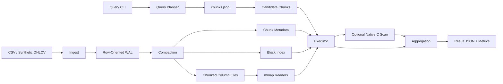

# TickDB

TickDB is a focused analytical database for OHLCV market data. It is built mostly in Python, with a small C scan kernel for the hottest numeric filter loop.

The project is intentionally narrow. It does not try to be a general SQL engine or a production time-series system. The goal is to make physical layout, metadata pruning, and scan-path tradeoffs explicit and measurable on market-data workloads.

## What It Does

TickDB takes OHLCV rows through a full read/write pipeline:

1. append rows to an immutable WAL
2. compact WAL rows into chunked columnar files
3. plan queries from chunk metadata
4. prune chunks and intra-chunk blocks
5. read only required columns
6. execute aggregates with an optional native C numeric filter path

The fixed schema is:

- `symbol`
- `timestamp`
- `open`
- `high`
- `low`
- `close`
- `volume`

## Why This Project

The assignment asked for a non-trivial system built end to end. TickDB was designed to show depth in the parts of an analytical engine that actually change cost:

- physical storage layout
- column projection
- metadata-driven pruning
- block-level skipping
- native acceleration for a hot loop
- benchmark design and measurement

That makes the repository useful as both a working system and a systems-oriented engineering artifact.

## Architecture



The write side stays simple and append-friendly. The read side is where the system gets interesting: physical layout, chunk metadata, block metadata, and native filtering all work together to reduce the amount of data that must actually be scanned.

## Storage Layout

TickDB stores compacted data under a per-table directory:

```text
.tickdb/
  tables/
    bars/
      wal/
        000001.jsonl
      metadata/
        table.json
        chunks.json
      chunks/
        000000/
          meta.json
          block_index.json
          symbol.dict.json
          symbol.ids.u32
          timestamp.base
          timestamp.offsets.i64
          open.f64
          high.f64
          low.f64
          close.f64
          volume.i64
```

Key storage ideas:

- `symbol` is dictionary-encoded
- `timestamp` is stored as `base + offsets`
- numeric columns are fixed-width binary
- `meta.json` summarizes each chunk
- `block_index.json` summarizes row ranges inside a chunk

Chunk metadata answers:

> could this chunk possibly match?

Block metadata answers:

> inside a surviving chunk, which row ranges are still worth scanning?

## Why Two Physical Layouts?

TickDB supports two physical layouts at compaction time:

- `time`: sort rows by `(timestamp, symbol)`
- `symbol_time`: sort rows by `(symbol, timestamp)`

This is a physical storage choice, not a logical correctness choice. The same query result should come back from either layout. What changes is:

- which rows land in the same chunk
- which symbols appear together
- timestamp ranges per chunk
- how much metadata pruning is possible
- how many rows the executor actually scans

TickDB does **not** dynamically choose a layout at query time. A compacted table has one physical layout. For benchmarks, the same logical dataset is materialized twice:

- once in `time`
- once in `symbol_time`

That isolates the effect of row ordering on scan cost.

This matters for OHLCV workloads because the common query shapes are usually:

- narrow time windows
- one or a few symbols
- symbol plus time
- threshold predicates like `close > X` or `volume > Y`

Those patterns react strongly to physical ordering.

## Query Flow

At a high level, a query goes through these stages:

1. parse CLI query input into a structured query spec
2. load `metadata/chunks.json`
3. prune whole chunks using chunk metadata
4. open `block_index.json` for surviving chunks
5. prune blocks inside those chunks
6. read only the required column slices
7. optionally push one numeric predicate into the native C scan kernel
8. recheck full filter truth in Python
9. aggregate matching rows
10. return result rows plus execution metrics

Those metrics include:

- chunk counts
- block counts
- rows scanned
- pruning rates
- native-scan usage

## Performance Techniques

TickDB’s performance story is intentionally explicit:

- **Column projection**: only required columns are read for a query
- **Chunk pruning**: chunk summaries eliminate irrelevant chunks early
- **Block pruning**: block summaries eliminate irrelevant row ranges inside surviving chunks
- **mmap readers**: fixed-width columns are read through memory-mapped files
- **Native scan kernel**: the hottest remaining numeric filter loop can run in C

The C path is intentionally narrow. It does not own the whole executor. It only evaluates an eligible numeric predicate over a block-local numeric buffer and returns a one-byte-per-row mask. Planning, fallback behavior, and correctness rechecks stay in Python.

## Quickstart

Install:

```bash
python3 -m venv .venv
source .venv/bin/activate
pip install -e .
```

Generate sample OHLCV data:

```bash
tickdb generate \
  --symbols AAPL,MSFT,NVDA \
  --rows 10000 \
  --output data/sample_ohlcv.csv
```

Ingest into the WAL:

```bash
tickdb ingest \
  --table bars \
  --file data/sample_ohlcv.csv
```

Compact into read-side storage:

```bash
tickdb compact \
  --table bars \
  --chunk-size 10000 \
  --layout time \
  --block-size-rows 1024
```

Plan a query:

```bash
tickdb query-plan \
  --table bars \
  --agg avg:close \
  --filter symbol=AAPL
```

Execute a query:

```bash
tickdb query \
  --table bars \
  --agg avg:close \
  --filter symbol=AAPL
```

Force the pure-Python filter path:

```bash
tickdb query \
  --table bars \
  --agg avg:close \
  --filter symbol=AAPL \
  --disable-native-scan
```

Run tests:

```bash
python3 -m unittest discover -s tests
```

## Benchmark Methodology

The benchmark harness is built around one principle:

> change one systems variable at a time, keep the logical workload fixed.

Current benchmark setup:

- `1,000,000` rows
- `10` symbols
- `10,000` rows per chunk
- `1,024` rows per fine block
- `1` warmup run
- `3` measured runs
- median runtime reported

Three benchmark comparisons are included:

1. **Layout baseline**
   - compare `time` vs `symbol_time`
2. **Block-index comparison**
   - compare chunk-only scanning vs chunk + block pruning
3. **Native scan comparison**
   - compare Python numeric filtering vs native C numeric filtering

Saved harnesses and result artifacts live under [benchmarks/](benchmarks/).

## Benchmark Results

These are the committed `1,000,000`-row results.

### 1. Layout Baseline

This benchmark asks:

> how much does physical row ordering change query cost?

| Query | `time` median ms | `symbol_time` median ms | Winner | Why |
| --- | ---: | ---: | --- | --- |
| `full_scan_count` | `486.034` | `485.816` | neutral | no pruning opportunity |
| `time_window_avg_close` | `11.711` | `68.414` | `time` | time-local chunks cut scan work from `100000` rows to `10000` |
| `symbol_volume_sum` | `557.618` | `94.456` | `symbol_time` | symbol clustering drops scan work from `1000000` rows to `100000` |
| `symbol_time_avg_close` | `34.312` | `11.623` | `symbol_time` | symbol locality dominates this symbol-plus-time query |

### 2. Block Index

This benchmark asks:

> once the right chunks are selected, can a finer-grained intra-chunk index reduce the remaining scan?

| Query | Layout | Chunk-Only ms | Block-Index ms | Rows Scanned |
| --- | --- | ---: | ---: | --- |
| `narrow_time_window_avg_close` | `time` | `9.294` | `2.040` | `10000 -> 1024` |
| `narrow_time_window_avg_close` | `symbol_time` | `70.509` | `9.710` | `100000 -> 10240` |
| `narrow_symbol_time_avg_close` | `time` | `7.726` | `1.855` | `10000 -> 1024` |
| `narrow_symbol_time_avg_close` | `symbol_time` | `10.247` | `1.918` | `10000 -> 1024` |

The block index is especially effective when chunk pruning is already good but still too coarse.

### 3. Native Scan

This benchmark asks:

> once the right rows are still going to be scanned, does moving the numeric predicate loop into C help?

| Query | Layout | Python ms | Native ms | Native Rows Evaluated | Speedup |
| --- | --- | ---: | ---: | ---: | --- |
| `narrow_time_window_avg_close` | `time` | `2.442` | `2.255` | `1024` | `7.66% faster` |
| `narrow_time_window_avg_close` | `symbol_time` | `8.760` | `4.778` | `10240` | `45.46% faster` |
| `symbol_close_threshold_sum_volume` | `time` | `597.195` | `478.409` | `1000000` | `19.89% faster` |
| `symbol_close_threshold_sum_volume` | `symbol_time` | `25.808` | `19.027` | `28192` | `26.27% faster` |

The native kernel helps modestly when the surviving scan is already tiny, and much more when the remaining numeric filter loop is still large.

## Benchmark Commands

```bash
make benchmark-baseline
make benchmark-block-index
make benchmark-native-scan
```

Smaller local rerun:

```bash
python3 benchmarks/run_layout_baselines.py --rows 100000 --force-rebuild
```

The Markdown summaries are optimized for readability. The raw JSON artifacts keep the fuller metric payload for deeper inspection.

## Success Criteria

TickDB is successful if it can:

- generate or ingest OHLCV data
- persist rows into a WAL
- compact WAL data into chunked columnar storage
- support two physical layouts for controlled comparison
- prune chunks and intra-chunk blocks
- read only required columns
- execute correct aggregates
- expose execution metrics
- show measurable layout, block-index, and native-scan effects in benchmarks

## Non-Goals

TickDB does not try to be:

- a full SQL database
- a distributed system
- a transactional engine
- a concurrent multi-writer store
- a production-grade QuestDB or DuckDB replacement

It is a focused OHLCV analytics engine designed to make storage and execution tradeoffs visible.

## Project Map

- [docs/design.md](docs/design.md)
- [docs/architecture.md](docs/architecture.md)
- [docs/milestone-04-compaction.md](docs/milestone-04-compaction.md)
- [docs/milestone-06-mmap-readers.md](docs/milestone-06-mmap-readers.md)
- [docs/milestone-07-query-planning.md](docs/milestone-07-query-planning.md)
- [docs/milestone-08-query-execution.md](docs/milestone-08-query-execution.md)
- [docs/milestone-09-pruning-metrics.md](docs/milestone-09-pruning-metrics.md)
- [docs/milestone-10-block-index.md](docs/milestone-10-block-index.md)
- [docs/milestone-11-native-scan.md](docs/milestone-11-native-scan.md)
- [benchmarks/README.md](benchmarks/README.md)

## Current Scope

Implemented:

- synthetic OHLCV generation
- CSV-to-WAL ingestion
- WAL-to-columnar compaction
- dictionary and delta encoding
- mmap readers
- query planning
- query execution
- chunk pruning
- block pruning
- native numeric scan
- benchmark harnesses and saved results

Deliberately omitted:

- full SQL parser
- joins
- concurrency
- durability beyond the prototype WAL/compaction flow
- streaming ingestion
