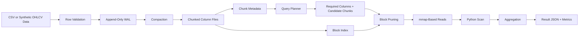
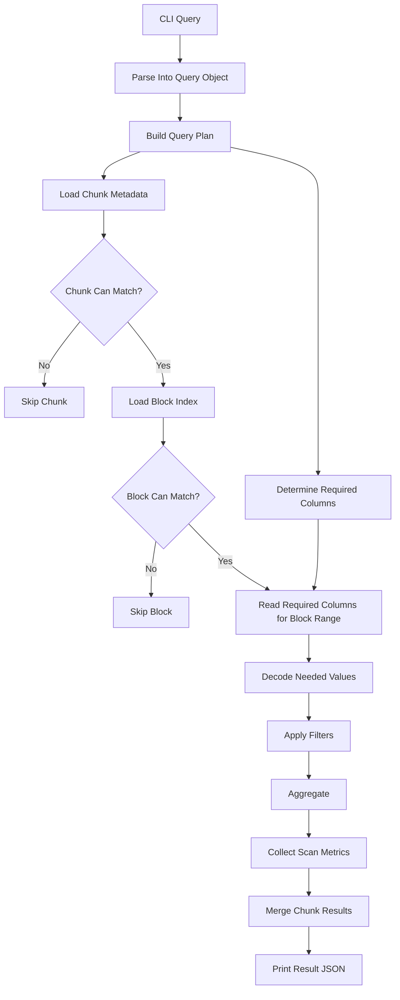

# TickDB Architecture

## End-to-End Flow



## Storage Layers

TickDB has two distinct storage layers.

### Row-Oriented Ingestion Layer

Purpose:

- append-friendly writes
- simple ingest boundary
- replay source for compaction

Format:

- per-table JSONL WAL

### Column-Oriented Read Layer

Purpose:

- read only required columns
- keep numeric data in fixed-width binary format
- prune chunks before reading heavy data

Format:

- per-chunk binary column files plus metadata

## Planned Chunk Layout

```text
chunks/
  000000/
    meta.json
    block_index.json
    symbol.dict.json
    symbol.ids.u32
    timestamp.base
    timestamp.offsets.i64
    open.f64
    high.f64
    low.f64
    close.f64
    volume.i64
```

Design implications:

- chunk-local dictionaries keep metadata and decode paths simple
- per-chunk files align naturally with pruning decisions
- fixed-width numeric columns are friendly to mmap reads

## Storage Walkthrough

One table directory contains two different storage layers:

```text
.tickdb/
  tables/
    bars/
      wal/
        000001.jsonl
      metadata/
        table.json
        chunks.json
      chunks/
        000000/
          meta.json
          block_index.json
          symbol.dict.json
          symbol.ids.u32
          timestamp.base
          timestamp.offsets.i64
          open.f64
          high.f64
          low.f64
          close.f64
          volume.i64
```

How to read that layout:

- `wal/` is the write-side log. It stores full JSON rows and is easy to append to.
- `metadata/table.json` stores table-level schema metadata.
- `metadata/chunks.json` stores the table-level manifest for compacted chunks.
- `chunks/000000/` is one compacted slice of rows in columnar form.
- `meta.json` stores per-chunk statistics used for pruning.
- `block_index.json` stores finer-grained per-block summaries used to prune inside a surviving chunk.
- `symbol.dict.json` plus `symbol.ids.u32` store the encoded symbol column.
- `timestamp.base` plus `timestamp.offsets.i64` store the encoded timestamp column.
- `open/high/low/close/volume` are fixed-width binary column files.

The important idea is that the WAL is the ingestion layer, while `chunks/` is the analytical read layer.

## Query Path



## Pruning Rules

Chunks can be skipped before reading column data when:

- the query symbol is not in the chunk symbol set
- the query time range does not overlap chunk time bounds
- numeric predicates cannot be satisfied from min/max metadata

Surviving chunks can then prune blocks inside the chunk using the same style of summaries over smaller row ranges.

Example:

If a query asks for `symbol = NVDA` and `close > 500`, a chunk can be skipped if:

- `NVDA` is absent from `symbols`
- or `close_max <= 500`

If the chunk survives, TickDB can still skip a block whose:

- `NVDA` is absent from block `symbols`
- or `close_max <= 500` for that block

## Layout Modes

TickDB will compare at least two physical layouts.

### Time Layout

Rows sorted by:

- `timestamp`

Expected benefit:

- good time pruning

Expected weakness:

- weaker symbol locality

### Symbol-Time Layout

Rows sorted by:

- `symbol`
- `timestamp`

Expected benefits:

- better symbol pruning
- stronger symbol locality
- more effective optional symbol RLE

This layout comparison is one of the core analytical stories in the project.

## Native Scan Boundary

The system boundary is:

- Python for CLI, storage orchestration, metadata, planning, and aggregation
- C for hot numeric filter loops

That division keeps the project understandable while still demonstrating low-level performance work where it matters.
