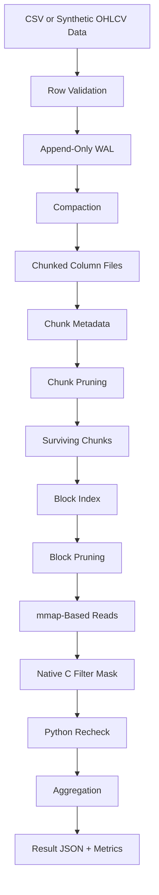
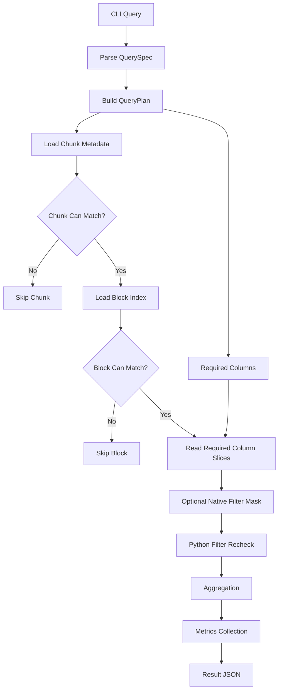

# TickDB Architecture

This document describes the current runtime architecture of TickDB as it exists in the repository.

## End-to-End Flow



## Storage Layers

TickDB has two storage layers with different jobs.

### WAL Layer

- row-oriented
- append-friendly
- simple ingest boundary
- source for later compaction

Format:

- per-table JSONL files under `wal/`

### Compacted Read Layer

- column-oriented
- chunked into fixed-size row groups
- includes metadata for pruning
- optimized for analytical reads

Format:

- per-chunk binary column files plus metadata

## On-Disk Layout

```text
.tickdb/
  tables/
    <table>/
      wal/
        000001.jsonl
      metadata/
        table.json
        chunks.json
      chunks/
        000000/
          meta.json
          block_index.json
          symbol.dict.json
          symbol.ids.u32
          timestamp.base
          timestamp.offsets.i64
          open.f64
          high.f64
          low.f64
          close.f64
          volume.i64
```

Key roles:

- `wal/` stores raw row appends
- `metadata/chunks.json` is the table-level manifest
- `meta.json` stores per-chunk pruning summaries
- `block_index.json` stores per-block pruning summaries inside a chunk
- numeric columns are fixed-width binary files

## Query Path



## Physical Layouts

TickDB supports two compaction layouts:

- `time`: rows sorted by `(timestamp, symbol)`
- `symbol_time`: rows sorted by `(symbol, timestamp)`

The query engine does not switch layouts dynamically. A query runs against whichever physical layout the table was compacted with.

## Native Boundary

TickDB keeps most of the system in Python:

- planning
- metadata loading
- chunk pruning
- block pruning
- fallback behavior
- aggregation

The only native path is the hot numeric filter loop over surviving block-local arrays. The C kernel writes a byte mask, and Python still performs exact recheck before aggregation.
